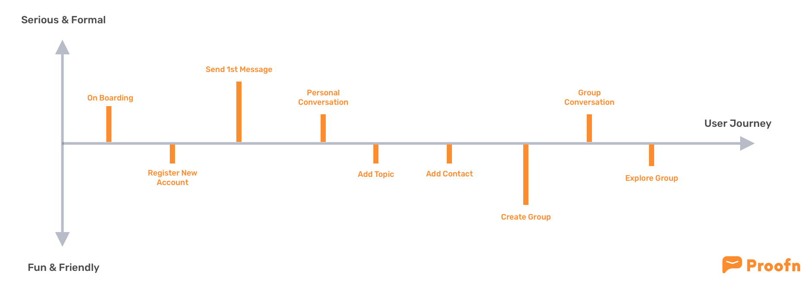

# Tone & Voice

**Why tone and voice are important**

* It’s an expression of your **core brand values**
* It makes your company **more human**
* It builds **trust** and makes people more attached to the brand
* It makes your company **stand out from the competition**

## **Proofn Tones**

### **Proofn tones are:**

* **Serious & Formal**
* **Fun & Friendly**

### **Serious & Formal**

* On Boarding
* Send 1st Message
* Personal Conversation
* Group Conversation

Why:

* Because in onboarding we want to show clear and formal word
* In Compose message screen will often used kind of formal communication
* Information in conversation we want to make serious and formal, because conversation will used to formal communication but for non formal there's no problem there.

### **Fun & Friendly**

* Register New Account
* Add Topic
* Add Contact
* Create Group
* Explore Group

Why:

* _In those screen we need to add some fun & friendly wording to make user not feel Proofn is used for serious communication only_

## Three main characteristic Proofn's voice

### **Intelligible**

Basically users are less interested in information that is too long, and they don't have time to read all the information. Put your important word or phrase in the front of sentences. So that the user's eyes catch important words when they scan the message information displayed. Be concise, understand the needs of users in certain situations and give them enough information to help perform tasks successfully on the application. Give useful information directly and quickly to offer help.

### **Catchy**

Use natural voice so that users can be easily understood and remember. Describe something in a friendly manner that does not use a frontal or aggressive language that can make users afraid to explore the application. Use the persusasive sentences on certain pages to encourage users to try. Finally, Do not forget to use polite and pleasant language to make users comfortable using the application for a long time and not excessive use.

### **Professional**

Users need special space when communicating about important matters or relating to their business. Provide serious information format, so that the information provided does not seem to play around or confuse the users. Add formal language and do not seem to act like a teacher be know-it-all in some message information in the application. Be consistent, surprise and uncertainty make people uncomfortable using an application. Words in the application must be considered carefully, so that users feel like they are special and have a pride when communicating. 

