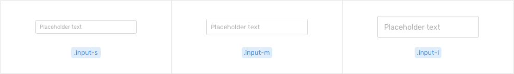
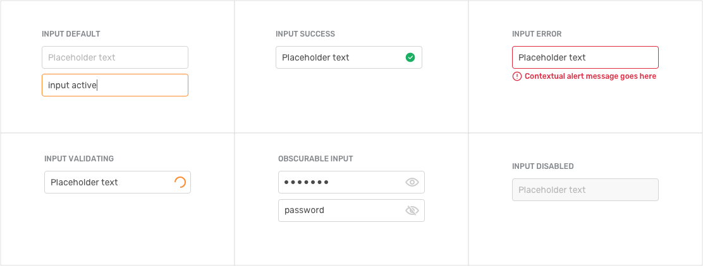
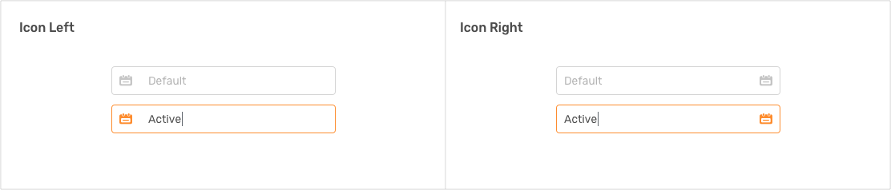
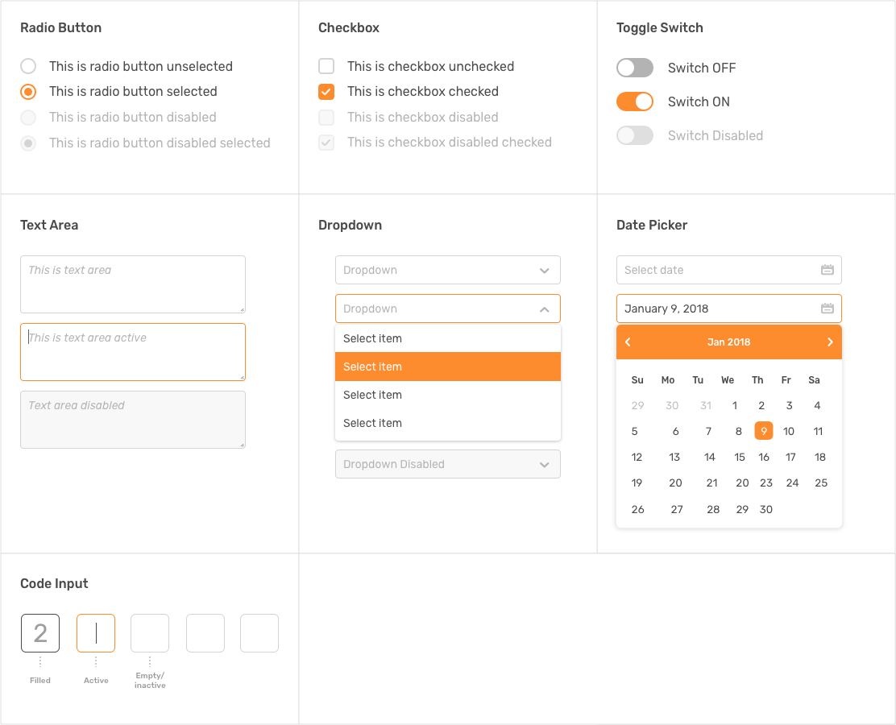

# Forms

## Input Sizes

Input fields come in four sizes which can be applied with .input-s .inpit-m and .input-l on the .input component itself.

### **Input States**

An input field can show a user is currently inreacting with it

### **Input with context**

Sometimes there might be the need for pre set context to inputs.

### **Input with icon**

Input with icons are wrapped in a parent component .uiicon which has to have the button size applied to with an additional class. for example input-m will have parent element with class .uiicon-m the icon has to be placed straight after the button and should be an inline SVG

### Additional Form UI

Forms are comprised of text and input components such as checkboxes, dropdowns, input fields, radio buttons, text area, date picker, toggle switches & code input. The easier users can complete forms, the better your response rates will typically be. Forms should be clear, concise, and relevant to its context.

