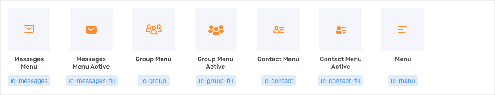

# Iconography

### **Navigation**

### Drawer \(using two-tone color\)

### **Messages View Action**

### **Action**

### Misc

### Other

### **Files icon Set**

### Iconfont & Asset

Icon fonts are just fonts. However, instead of containing letters or numbers, they contain symbols and glyphs. You can style them with CSS in the same way you style regular text which has made them a popular choice on the web.





