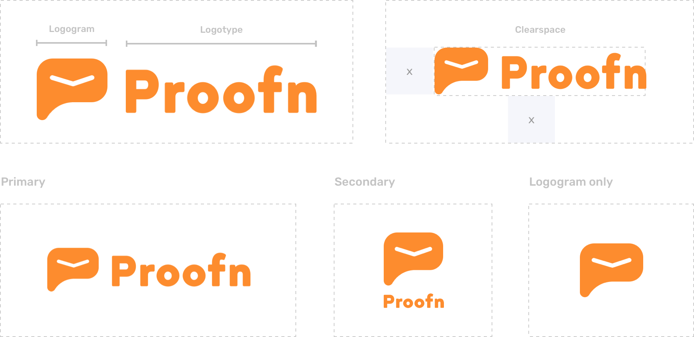
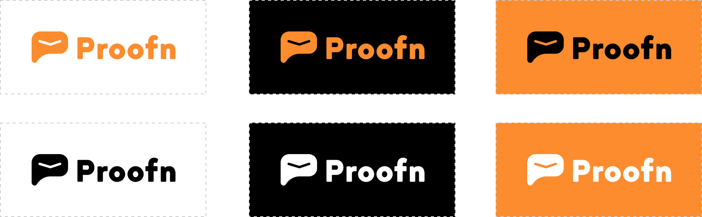
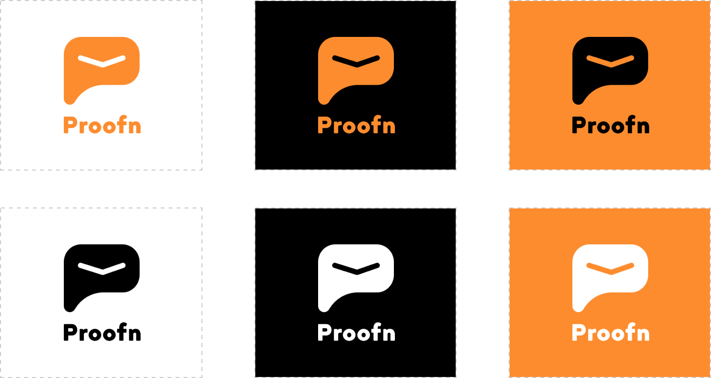

# Logos

### Logo Components

Proofn logo consists of two components logogram and logotype. The application of Proofn logo in horizontal space, vertical space & logogram only.

### Primary Logo

Please use our one-color logo most of the time. Keep our glyph and the wordmark in white, black and orange \(proofn\) color.   
  
[Download Primary Logo](https://dribbble.com/shots)

### Secondary Logo

Please use our one-color logo most of the time. Keep our glyph and the wordmark in white, black and orange \(proofn\) color.  
  
[Download Secondary Logo](https://dribbble.com/shots)

### Logogram Only

Please use our one-color logo most of the time. Keep our glyph in white, black and orange \(proofn\) color.  
  
[Download Logogram Only](https://dribbble.com/shots)

### Incorrect Use

