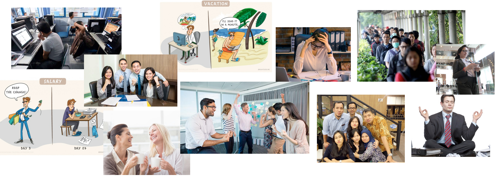

# Product Illustration

The big theme is the glue that brings together the copy \(or UX writing\), illustration, and everything else in cohesion. It strengthens the brand voice, and it distinguishes us from other products.

**Our big themes, that I proposed is :**

_What really we want to capture is depicting the professional atmosphere of Indonesian people. Need to know what actually they interact with, what they struggling with, what their kind of joke that fit in for not to make them cringe. So we hope when they use Proofn, they can directly connect and become their work partner_

