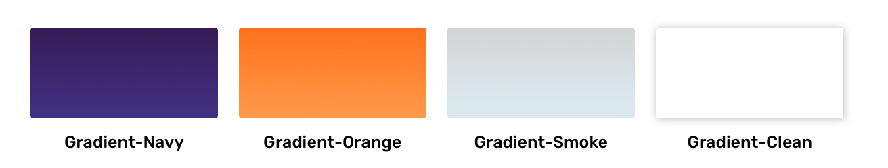
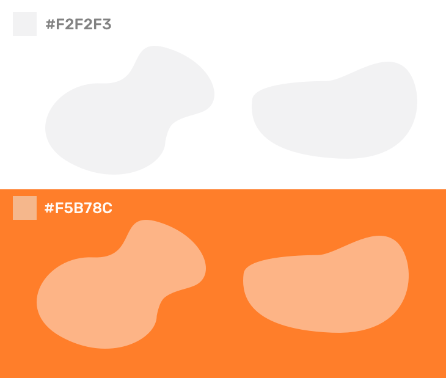

# Guideline

## Base Color

Untuk membuat konsistensi disetiap illustrasi disetiap perangkat, maka dari itu dibutuhkan warna yang selaras dengan brand Proofn, untuk pewarnaan disetiap asset sendiri menggunakan _Primary Color Gradient_

## Color Balance

Color balance berfungsi untuk membuat warna yang digunakan sesuai dan tidak saling bertolak antar warna dan membuat warna yang dihasilkan seimbang

## **Background**

Background berfungsi memberikan ruang dan aksen terhadap setiap assets illustrasi

## **Stroke**

Kami tidak menggunakan dropshadow untuk illustrasi sebagai gantinya kami menggunakan dropshadow sebagai pemisah antar warna

## **Best Practice**

