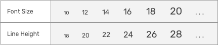

# Typography

## Font Family

Proofn menggunakan **Rubik** sebagai font-family disetiap produknya. **Rubik** merupakan sebuah font yang memiliki sudut sedikit membulat, Rubik juga memilikiFont untuk Bahasa Hebrew. Font ini didesain oleh Phillip Hubert dan Sebastian Fischer. Font ini dirasa cocok untuk Proofn, karena memiliki desain yang minimalis, indah, dan berisi.

[Download font here](https://fonts.google.com/specimen/Rubik?selection.family=Rubik)

### **Ukuran Font Dasar**

Ukuran font dasar untuk proofn untuk versi web menggunakan ukuran **14pt**, sama juga untuk ukuran dasar Proofn versi mobile. Proofn menggunakan perbandingan menggunakan font ukuran Genap dan tidak menggunakan font dengan ukuran ganjil.

### Font Scale & Line Height

Font Scale dan Line Height dapat menentukan keindahan dinamika dan urutan sistem font. Ukuran ini dapat menentukan kenyamanan user dan Proofn memiliki Font Scale & Line Height seperti dibawah ini:

### Type Scale

### Font Weight

Proofn menggunakan dua tipe weight dalam font Rubik, yaitu Regular\(400\) dan Medium\(500\). Alasan menggunakan dua jenis Font Weight ini karena keduanya sudah cukup untuk memenuhi prinsip-prinsip keteraturan, stabilitas dan pengendalian.

