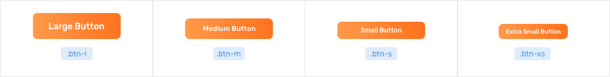
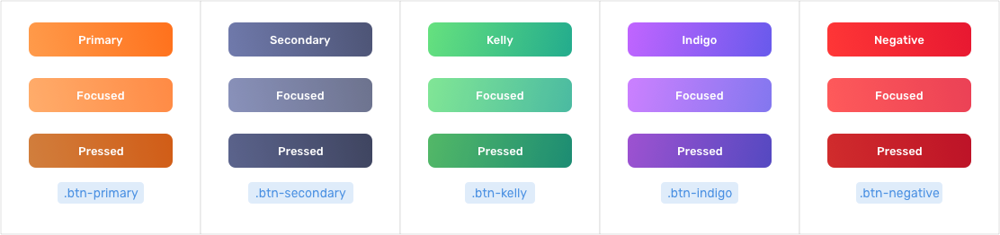
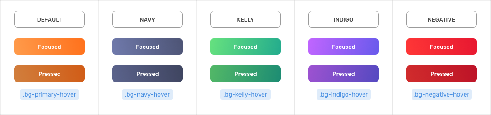
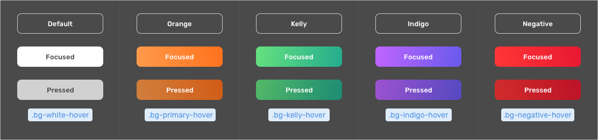
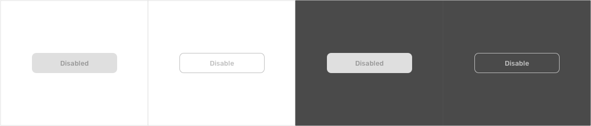
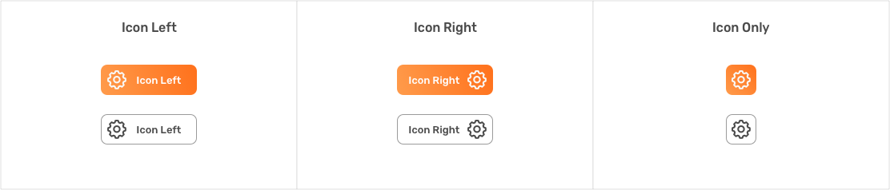
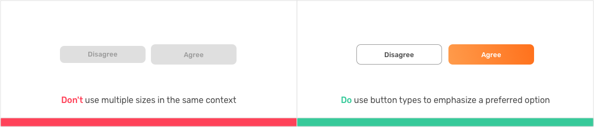

# Buttons

### **Button sizes**

Define a button size with **.btn-xs .btn-s .btn-l** the default button size is **.btn-m**

### **Default Button**

Buttons Collors should be used to signify necessary or mandatory actions. There are four color options, specified with an additional class**. primary, secondary** or with another colors **kelly, indigo** and **negative**

### **Ghost Button**

### **Ghost Button on dark background**

### **Disabled Button**

### **Button with icon**

### **Associated Actions**

