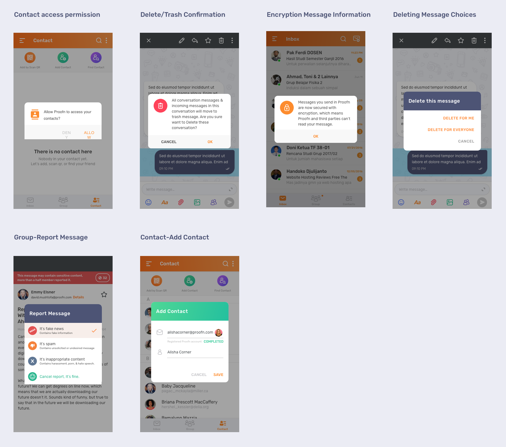
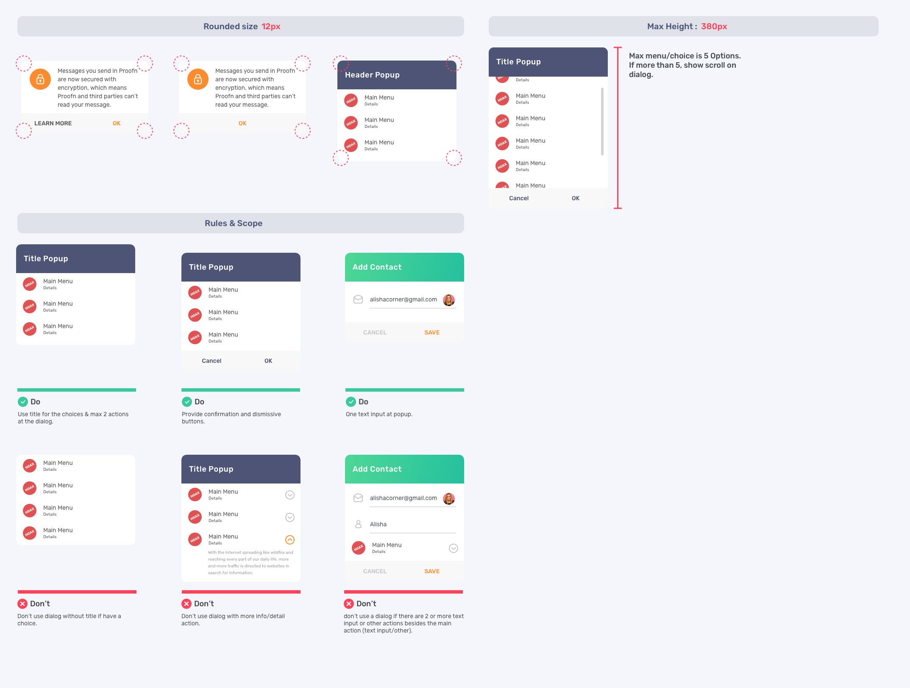
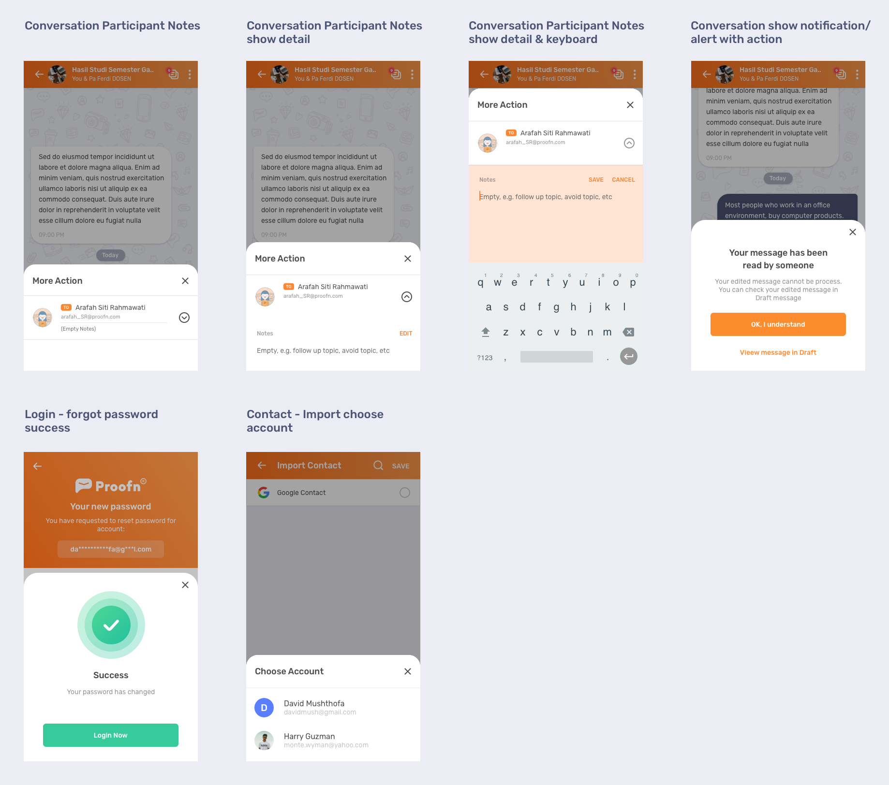
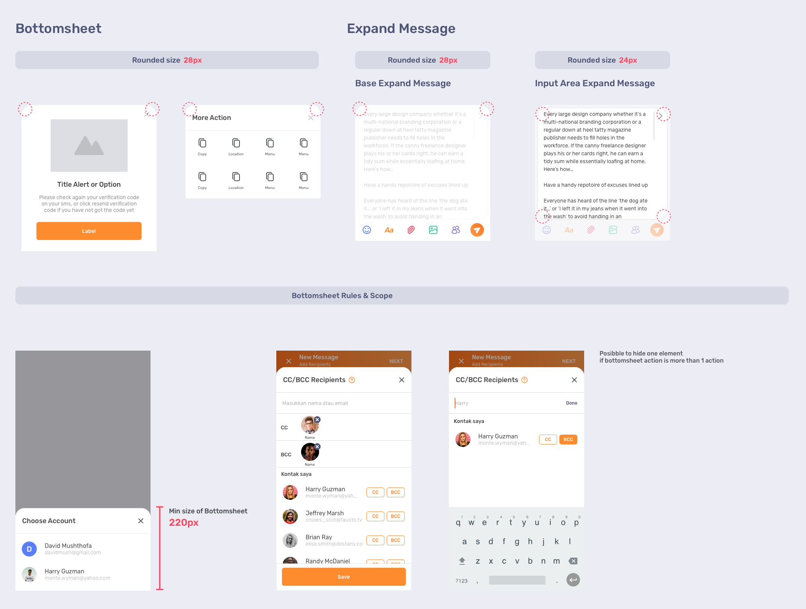
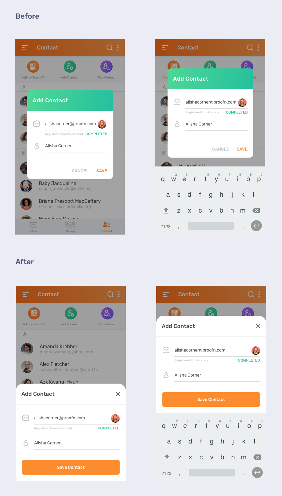
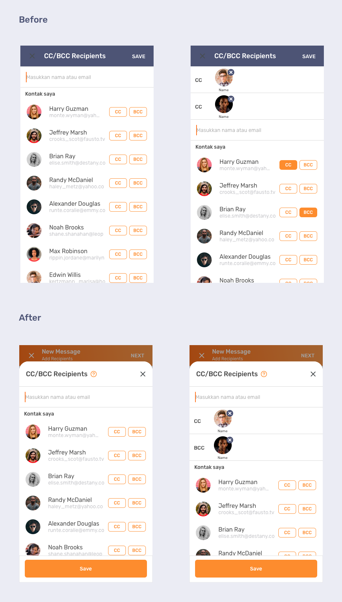

# Pop Ups & Bottomsheet

## **Popup**

Generally for all actions that require user confirmation and action options for users who do not have much information or action details \(additions\) of the choice. The rest for choices between popups or bottomsheets can be adjusted again with information needs that want to be addressed to the user or a decision with the product team.

## **Bottomsheet**

Bottom sheet is a component that slides up from bottom of the screen to reveal more content.

It's basically a dialogue but can contain a lot of information and some detailed actions.

## **Need to be Change - Popup to Bottomsheet**

Umumnya untuk semua aksi yang membutuhkan konfirmasi user dan pilihan aksi untuk user yang tidak memiliki informasi yang banyak ****atupun aksi detail \(tambahan\) dari pilihan tersebut.

