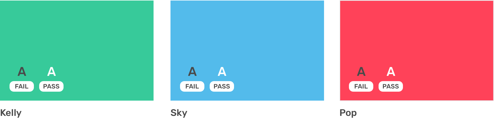

# Colors

### Primary Color Pallete 

Our primary palette is comprised of neutrals, white, orange & navy. These colors are present across most touch points from marketing to product. If you're keen to use the color palette you can download the palette here

| \#FD8C2E | \#4D5475 | \#FFFFFF |
| :--- | :--- | :--- |

### Secondary Color Pallete 

Our secondary palette is made up of red, yellow, green, teal, and purple. Each color is selected with purpose in order to provide meaningful feedback within our products. See the Color System below for more information.

| \#37CA9A | \#53BBEB | \#FF4259 |
| :--- | :--- | :--- |

### Neutrals

| \#4A4A4A | \#9B9B9B | \#BFBFBF | \#DFDFDF | \#F5F6FB |
| :--- | :--- | :--- | :--- | :--- |

